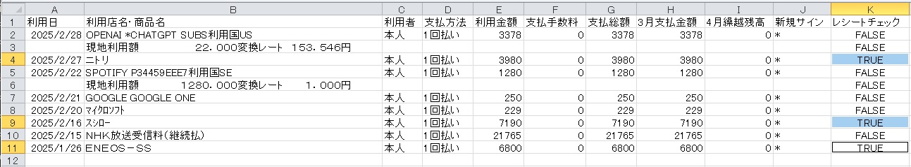

# OCR Receipt Processor

このプロジェクトは、OCR（光学文字認識）を使用してレシート画像から情報を抽出し、CSVファイルと照合するPythonスクリプトです。Google Cloud Vision APIを利用してOCRを実行し、RapidFuzzを使用してファジーマッチングを行います。

## 主な機能

1. **レシート画像のOCR処理**:
   - Google Cloud Vision APIを使用してレシート画像からテキストを抽出します。
   - 日付、店舗名、金額を解析して抽出します。

2. **CSVファイルとの照合**:
   - 抽出した情報を複数のCSVファイルと照合します。
   - 店舗名の正規化や部分一致をサポートし、RapidFuzzを使用してファジーマッチングを実施します。
   - **一致する行に「レシートチェック」列を追加し、TRUEを記入します。**

3. **結果の保存**:
   - 一致したレシート情報を`matched_patterns.csv`に保存します。
   - 一致しなかったレシート情報を`unmatched_patterns.csv`に保存します。
   - 一致したレシート画像を`matched`フォルダに移動します。

## 必要な環境

- Python 3.8以上
- Google Cloud Vision APIの認証情報
- 以下のPythonライブラリ:
  - `google-cloud-vision`
  - `pandas`
  - `Pillow`
  - `rapidfuzz`
  - `pykakasi`

## インストール

1. 必要なライブラリをインストールします。

   ```bash
   pip install google-cloud-vision pandas pillow rapidfuzz pykakasi
   ```

2. Google Cloud Vision APIの認証情報を設定します。
   - Google Cloud Consoleでサービスアカウントキーを作成し、JSONファイルをダウンロードします。
   - 環境変数`GOOGLE_APPLICATION_CREDENTIALS`にJSONファイルのパスを設定します。

   ```bash
   set GOOGLE_APPLICATION_CREDENTIALS=path\to\your\credentials.json
   ```

## 使用方法

1. **レシート画像を準備**:
   - レシート画像を`G:\マイドライブ\receipt\receipt_img`フォルダに配置します。
   - 対応するCSVファイルを`G:\マイドライブ\receipt\csv_statements`フォルダに配置します。
   - **CSVファイルは楽天e-Naviからダウンロードした利用明細書を使用します。サンプルファイルは`csv_statements`フォルダにある`enavi202503(xxxx).csv`です。**

2. **スクリプトを実行**:
   - 以下のコマンドでスクリプトを実行します。

   ```bash
   python extract_receipt_info_one_folder_RapidFuzz.py
   ```

3. **結果の確認**:
   - 一致したレシート情報は`G:\マイドライブ\receipt\receipt_img\matched_patterns.csv`に保存されます。
   - 一致しなかったレシート情報は`G:\マイドライブ\receipt\receipt_img\unmatched_patterns.csv`に保存されます。
   - 一致したレシート画像は`G:\マイドライブ\receipt\receipt_img\matched`フォルダに移動されます。

## サンプル画像

以下は、このプロジェクトで使用されるサンプル画像の例です。

### レシート画像の例


この画像はOCR処理の対象となるレシートの例です。Google Cloud Vision APIを使用して、この画像から日付、店舗名、金額を抽出します。

### 処理結果の例


この画像は処理結果の例を示しています。一致した場合、CSVファイルの"レシートチェック"列に`TRUE`が記録されます。

## ファイル構成

- `extract_receipt_info_one_folder_RapidFuzz.py`: メインスクリプト。
- `csv_statements/`: 照合対象のCSVファイルを格納するフォルダ。
  - **楽天e-Naviからダウンロードした利用明細書（例: `enavi202503(xxxx).csv`）を配置します。**
- `receipt_img/`: レシート画像を格納するフォルダ。

## 主な関数

### `extract_receipt_info(image_path: Path) -> dict`

- レシート画像から日付、店舗名、金額を抽出します。

### `mark_receipt_in_csv(csv_path: Path, info: dict, mismatches: list) -> bool`

- 抽出した情報をCSVファイルと照合し、一致した場合はCSVを更新します。
- **一致した行に「レシートチェック」列を追加し、TRUEを記入します。**

### `main()`

- レシート画像を処理し、結果を保存します。

## 注意事項

- Google Cloud Vision APIの利用には料金が発生する場合があります。
- レシート画像の品質が低い場合、OCRの精度が低下する可能性があります。

## ライセンス

このプロジェクトはMITライセンスの下で提供されています。

---
2025/05/05 keides2 初版
